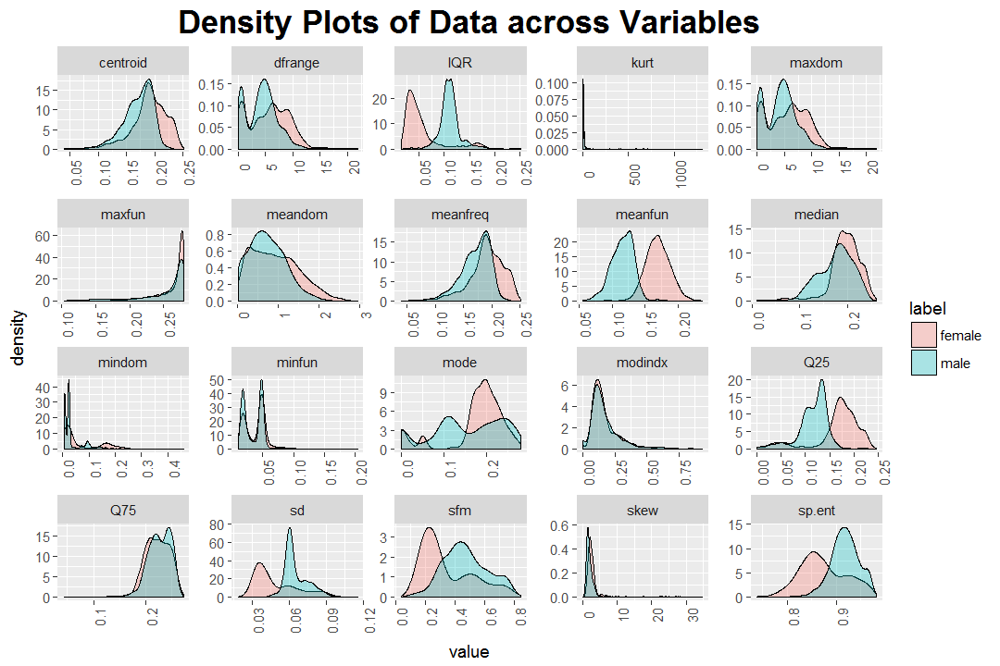
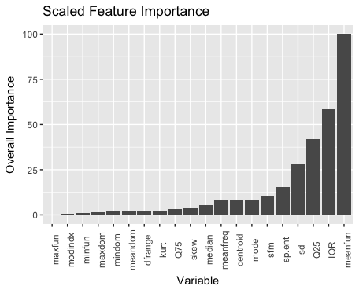

# Gender Recognition by Voice Data

## Introduction
This repository is the final project for Math 2820 Lab (Intro to Probability and Statistic). Cooperate with 
Kenny Li and Alex DiCesare.

This database was created to identify a voice as male or female, based upon acoustic properties of the voice and speech. The dataset consists of 3,168 recorded voice samples, collected from male and female speakers. The voice samples are pre-processed by acoustic analysis in R using the seewave and tuneR packages, with an analyzed frequency range of 0hz-280hz

Data obtain from Kaggle, [GenderRecognitionByVoice](https://www.kaggle.com/primaryobjects/voicegender).

## Details
---
title: "Gender Prediction by Voice - 2820L Term Project"
author: "Alex DiCesare, Kenneth Li, and Ken Yang"
date: "April 22, 2017"
output: 
  html_document:
    toc: true
    toc_float: true

---

```{r setup, include=FALSE}
knitr::opts_chunk$set(echo = TRUE)
```

# Gender Recognition by Voice

Basic environment setup code.
```{r, results='hide'} 
library(ggplot2)
library(dplyr, warn.conflicts = FALSE)
library(broom)
library(class)
library(caret)
library(plotROC)
library(rattle)
library(rpart.plot)
## some of the packages may need to be installed

voice <- read.csv("voice.csv")
## summary(voice)
```

## Introduction 

Determining the gender of a voice is normally a very simple task. Typically, our ears are easily able to recognize the gender of the person speaking within a few words. We wanted to see if this held true for statistical models as well. We set out to explore the relationship between the acoustic properties of a voice and the speaker's gender, and attempted to create a model that could predict the gender of a voice as accurately as the human ear. This project focuses on the general process of approaching a classification problem, through data exploration, model creation, and model improvement.

## Data Exploration

Before exploring basic trends in the data, the dataset was examined for anomalies, null values, and other characteristics that would skew our analysis. Since this dataset was from Kaggle, it was relatively prepared for processing aside from a few zero-values that were not explained in documentation. The dataset has 20 numerical features with 3,168 entries labelled as male or female. There were equal counts of male and female entries, and nearly every variable had eight degrees of decimal precision.

Since these were domain-specific features rooted in acoustic analysis, no inferences could immediately be made about the relative importance of features and what an entry would realistically sound like given the sound data. However, the data could be visualized to look for differentiating features given the gender labels. In the below figure, density plots are created for each feature and factored by label. Through this visual, it could be seen that mean fundamental frequency `meanfun`, IQR `IQR`, and the first frequency quantile `Q25` depict distinct peaks in densities. This suggests that these three features are primary predictors in the classification problem, and could be focused on for a strong portion of accuracy. In other density plots that display a lot of overlap, it is difficult to distinguish genders based solely on such features. There is more to be explored about the relationship between these features, though we can move onto building basic prediction models.



The below scatterplot of meanfun vs. IQR depicts a striking differentiation between the two genders, corresponding with our conclusions from the density plots.


### More on Feature Importance

By training a random forest model with the data, feature importance could also be visualized by how often features were selected for the model. The below graph displays the frequencies of selection across variables scaled over the total number of trees in the model. This further suggests that `meanfreq`, `IQR`, and `Q25` are important features.



## Models

### Logistic Regression
We first considered a logistic regression model as a basic prediction technique for the data. As stated in the Data Exploration section, our label is a binomial variable (male, female). Therefore, we try logistic regression. 

#### Basic Logistic
Our data set has 20 numerical features. At the first glance with a density plot in previous section, we estimate that mean fundamental frequency `meanfun`, IQR `IQR` and first frequency quantile `Q25` are the most dominant variables. Thus, we build a basic logistic model on these 3 variables.

```{r}
# Logistic Regression using meanfun, IQR, Q25
fit.mf <- glm(
  label~meanfun+IQR+Q25, 
  data = voice, 
  family = "binomial"
)
# get the prediction and mutate it into binary output
mf.prob.pred <- predict(
  fit.mf, 
  newdata = voice, 
  type = "response"
)

mf.outcome.pred <- ifelse(mf.prob.pred > .5, 
                          "predict male", 
                          "predict female")

mf.df.prediction <- data.frame(
  predict = mf.outcome.pred,
  actual = voice$label
)

# get the prediction table (updated for meanfun model)
mf.table <- table(mf.df.prediction$predict, mf.df.prediction$actual)
mf.table
```

As the result shows, the model gives a true positive rate of (assume female to be true) 1524 / 1584 = 0.96, which is a very nice result. 

We can also plot the ROC curve of our basic model.
```{r}
glm_1_roc <- data.frame(D = as.numeric(voice$label)-1, M = mf.prob.pred)
ggplot(glm_1_roc, aes(d = D, m = M)) + geom_roc() + 
  labs(title = "Logistic Regression ROC")+
  theme(plot.title = element_text(size = 18, face = "bold", hjust = 0.5), 
        text= element_text(size = 14))
```


#### Improving Logistic Regression
Although the true-positive rate of our basic model is quite satisfying, we can't prove that our model uses the best variable set. One way to improve our model is to use a stepwise variable selection technique.

```{r, results = "hide"}
## predict gender using variable selection
fit.all <- glm(label~., data = voice, family="binomial")
fit.none <- glm(label~1, data = voice, family="binomial")

# Forward selection
fit.result <- step(fit.none, 
                   scope = list(lower = fit.none,
                                upper = fit.all),
                   direction = "forward")

all.prob.pred <- predict(fit.result, newdata = voice, type = "response")
all.outcome.pred <- ifelse(all.prob.pred > .5, 
                           "predict male", 
                           "predict female")

all.df.prediction <- data.frame(
  predict = all.outcome.pred,
  actual = voice$label
)

all.table <- table(all.df.prediction$predict, all.df.prediction$actual)
```

```{r}
fit.result
all.table
```
As we can see, the final model using variable seleciton is based on 8 variables out of the 20. The true-positive rate in this model is 97.3%, higher than our basic model.

The ROC plot of this improved model is also shown below. Note that this plot is rather similar to the previous one due to marginal improvements.

```{r}
all_1_roc <- data.frame(D = as.numeric(voice$label)-1, M = all.prob.pred)
ggplot(all_1_roc, aes(d = D, m = M)) + geom_roc() +
  labs(title = "AIC Model ROC")+
  theme(plot.title = element_text(size=18, face = "bold", hjust = 0.5), 
        text = element_text(size=14))
```


### Supervised Machine Learning 

#### K-Nearest-Neighbors 
K-Nearest-Neighbors (KNN) is a popular prediction model that could be used for classification and regression problems. We develop a simple KNN model using `meanfun` and `IQR`. We choose K to be 5 in our model.

```{r}
# first break the data set into train set and test set
voice.sub <- voice %>% select(meanfun, IQR, label)

row <- nrow(voice)
set.seed(1234)
voice.train <- voice.sub %>% sample_n(row*9/10)
voice.test <- setdiff(voice.sub, voice.train)
  
# then get data without label and separate label out
train.data <- voice.train %>% select(-label)
test.data <- voice.test %>% select(-label)
train.label <- voice.train$label
test.label <- voice.test$label

# perform KNN with K = 5
knn.pred.5 <- knn(train.data, test.data, train.label, 5)
table(knn.pred.5, test.label)

# Plot KNN:
test <- test.data %>% mutate(
  Label = knn.pred.5
)

grid <- expand.grid(
  meanfun = seq(0, 0.3, length.out = 100),
  IQR = seq(0, 0.3, length.out = 100)
)

set.seed(1234)
grid5.pred <- knn(train.data, grid, train.label, 5)

ggplot(test, aes(x=meanfun, y=IQR)) +
  geom_point(aes(pch=Label, color = Label), size = 1) +
  geom_point(data = grid, 
             mapping = aes(x=meanfun,y=IQR,color=grid5.pred), 
             alpha = .1) + 
  labs(title = "KNN Model plotted over Meanfun and IQR")+
  theme(plot.title = element_text(size = 18, hjust = 0.5, face = "bold"), 
        text = element_text(size = 14))

```

The true-positive rate in the test set is 169/174 = 97.1%. 

#### Train/Test Set Partitioning and Cross-Validation 
Before training further models, the dataset was split into a training set that was 80% as large and test set with the remaining data. GIven that the labels are evenly split, a similarly even split of labels should be expected. Additionally, a cross-validation control variable was used. This allows for our models to be cross-validated 10 times using a logloss summary function. 
```{r}
# Create data partition
set.seed(4321)
trainindex <- createDataPartition(
  y = voice$label,
  p = .8,
  list = FALSE
)

cv_train <- voice[trainindex, ]
cv_test <- voice[-trainindex, ]

# create control variable
control_var <- caret::trainControl(
  method = "cv",
  number = 10,
  classProbs = TRUE,
  summaryFunction = mnLogLoss
)
```

#### Decision Tree
Decision tree is another great option for binary classification problem, with a super fast learning rate and informative model.

```{r}
# train with decision tree method
dtree_fit <- caret::train(
  label~.,
  data = cv_train,
  method = "rpart",
  trControl = control_var
)
dtree_fit
```

The best accuracy we get is 96%. We found a way to visualize the tree as follows.
```{r}
## Visualize the decision tree
fancyRpartPlot(dtree_fit$finalModel)
```

## Conclusion

Through developing basic prediction models for this dataset, we have seen some interesting results. Data exploration suggested that the most distinguishing features of the voice data were mean fundamental frequency `meanfun` and the interquantile range `IQR`. In general, males tend to have a lower mean frequency of voice and their voice's IQR is higher. Some other helpful features include the standard deviation of voice and first quantile of voice. 

Out of the models we developed, the outstanding ones were logistic regression, KNN, decision tree and random forest. We used variable selection in logistic regression to get a more thorough model with accuracy of 97%. For the supervised machine learning models, the decision tree model had the fastest learning rate with an accuracy of 95% to 96%. During this project, two KNN models were developed. One was trained only using `meanfun` and `IQR` and another was trained on the entire dataset. Both models have comparable performance by yielding an accuracy of about 96%, and so we chose to report the simpler KNN model. The performance of these models suggest that only a few features were helpful in the classification problem, and some could be omitted with marginal loss in accuracy. This outcome was also illustrated by our data exploration, where feature importance visualizations suggested a similar notion. 

In the process of building and training our models, we used knowledge and techniques we learned in the lab. Moreover, we sought after helpful online resources to generate visually appealing and representative plots for different models. In the future, we hope to improve upon basic models through fine tuning parameters after more thorough testing. Additionally, discovering more effective visualizations of our models' performances and the data itself will be beneficial practices. 


