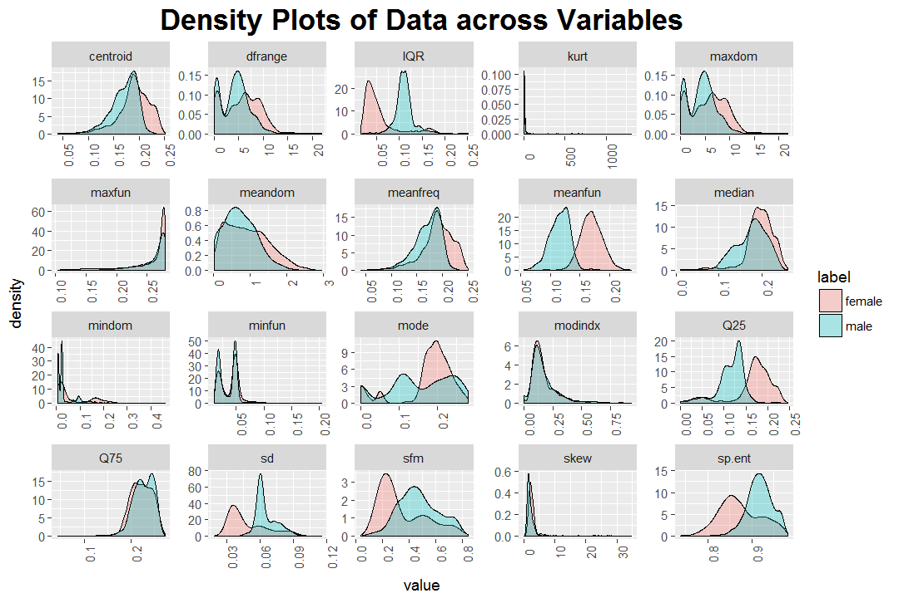
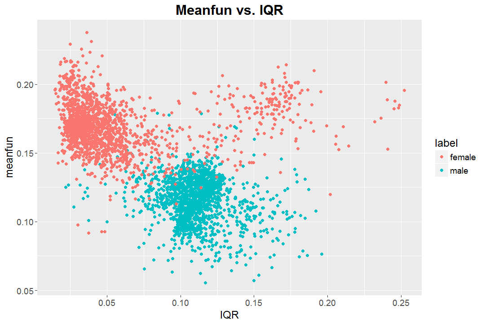
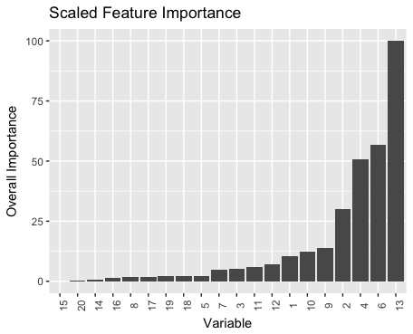
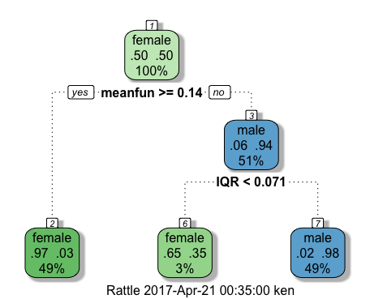

```{r setup, include=FALSE}
knitr::opts_chunk$set(echo = TRUE)
```

# Gender Recognition by Voice

Basic environment setup code.
```{r, results='hide'} 
library(ggplot2)
library(dplyr, warn.conflicts = FALSE)
library(broom)
library(class)
library(caret)
library(plotROC)
library(rattle)
library(rpart.plot)
## some of the packages may need to be installed

voice <- read.csv("voice.csv")
## summary(voice)
```

## Introduction 

Determining the gender of a voice is normally a very simple task. Typically, our ears are easily able to recognize the gender of the person speaking within a few words. We wanted to see if this held true for statistical models as well. We set out to explore the relationship between the acoustic properties of a voice and the speaker's gender, and attempted to create a model that could predict the gender of a voice as accurately as the human ear. This project focuses on the general process of approaching a classification problem, through data exploration, model creation, and model improvement.

## Data Exploration

Before exploring basic trends in the data, the dataset was examined for anomalies, null values, and other characteristics that would skew our analysis. Since this dataset was from Kaggle, it was relatively prepared for processing aside from a few zero-values that were not explained in documentation. The dataset has 20 numerical features with 3,168 entries labelled as male or female. There were equal counts of male and female entries, and nearly every variable had eight degrees of decimal precision.

Since these were domain-specific features rooted in acoustic analysis, no inferences could immediately be made about the relative importance of features and what an entry would realistically sound like given the sound data. However, the data could be visualized to look for differentiating features given the gender labels. In the below figure, density plots are created for each feature and factored by label. Through this visual, it could be seen that mean fundamental frequency `meanfun`, IQR `IQR`, and the first frequency quantile `Q25` depict distinct peaks in densities. This suggests that these three features are primary predictors in the classification problem, and could be focused on for a strong portion of accuracy. In other density plots that display a lot of overlap, it is difficult to distinguish genders based solely on such features. There is more to be explored about the relationship between these features, though we can move onto building basic prediction models.



The below scatterplot of meanfun vs. IQR depicts a striking differentiation between the two genders, corresponding with our conclusions from the density plots.



### More on Feature Importance

<text on random forest model>



<text on decision tree plot>



## Models

### Logistic Regression
Among all the models we tried on this data set, the first we consider is regression. As stated in Data Exploration section, our label is a binomial variable, linear regression is not a candidate.
Therefore, we try logistic regression. 

#### Basic Logistic
Our data set has 20 numerical features. At the first glance with a density plot in previous section, we estimate that mean fundamental frequency (meanfun), IQR and first frequency quantile (Q25) are the most dominant variables. Thus, we build our basic logistic model on these 3 variables.

```{r}
# Logistic Regression using meanfun, IQR, Q25
fit.mf <- glm(
  label~meanfun+IQR+Q25, 
  data = voice, 
  family = "binomial"
)
# get the prediction and mutate it into binary output
mf.prob.pred <- predict(
  fit.mf, 
  newdata = voice, 
  type = "response"
)

mf.outcome.pred <- ifelse(mf.prob.pred > .5, 
                          "predict male", 
                          "predict female")

mf.df.prediction <- data.frame(
  predict = mf.outcome.pred,
  actual = voice$label
)

# get the prediction table (updated for meanfun model)
mf.table <- table(mf.df.prediction$predict, mf.df.prediction$actual)
mf.table
```

As the result shows, the model gives a true positive rate of (assume female to be true) 1524 / 1584 = 0.96, which is a very nice result. 

We have also plot the ROC plot of our basic model.
```{r}
glm_1_roc <- data.frame(D = as.numeric(voice$label)-1, M = mf.prob.pred)
ggplot(glm_1_roc, aes(d = D, m = M)) + geom_roc() + 
  labs(title = "Logistic Regression ROC")+
  theme(plot.title = element_text(size = 18, face = "bold", hjust = 0.5), 
        text= element_text(size = 14))
```


#### Improve Logistic
Although the tp rate of our basic model is quite satisfying, we can't prove that our model uses the best variable set. One way to improve our model is to use the variable selection technique we learn in homework. 

```{r, results = "hide"}
## predict gender using variable selection
fit.all <- glm(label~., data = voice, family="binomial")
fit.none <- glm(label~1, data = voice, family="binomial")

# Forward selection
fit.result <- step(fit.none, 
                   scope = list(lower = fit.none,
                                upper = fit.all),
                   direction = "forward")

all.prob.pred <- predict(fit.result, newdata = voice, type = "response")
all.outcome.pred <- ifelse(all.prob.pred > .5, 
                           "predict male", 
                           "predict female")

all.df.prediction <- data.frame(
  predict = all.outcome.pred,
  actual = voice$label
)

all.table <- table(all.df.prediction$predict, all.df.prediction$actual)
```

```{r}
fit.result
all.table
```
As we can see, using variable selection, the final model is based on 8 variables out of the 20. The tp rate in this model is 97.3%, higher than our basic model.

The ROC plot of this improved model is also shown below. Note that this plot is rather similar to the previous one due to marginal improvements.

```{r}
all_1_roc <- data.frame(D = as.numeric(voice$label)-1, M = all.prob.pred)
ggplot(all_1_roc, aes(d = D, m = M)) + geom_roc() +
  labs(title = "AIC Model ROC")+
  theme(plot.title = element_text(size=18, face = "bold", hjust = 0.5), 
        text = element_text(size=14))
```


### Supervised Machine Learning 

#### KNN 
KNN is the model we learn in the lecture. Our first attempt is KNN with mean fundamental frequency and IQR. We choose K to be 5 in our model.

```{r}
# first break the data set into train set and test set
voice.sub <- voice %>% select(meanfun, IQR, label)

row <- nrow(voice)
set.seed(1234)
voice.train <- voice.sub %>% sample_n(row*9/10)
voice.test <- setdiff(voice.sub, voice.train)
  
# then get data without label and separate label out
train.data <- voice.train %>% select(-label)
test.data <- voice.test %>% select(-label)
train.label <- voice.train$label
test.label <- voice.test$label

# perform KNN with K = 5
knn.pred.5 <- knn(train.data, test.data, train.label, 5)
table(knn.pred.5, test.label)

# Plot KNN:
test <- test.data %>% mutate(
  Label = knn.pred.5
)

grid <- expand.grid(
  meanfun = seq(0, 0.3, length.out = 100),
  IQR = seq(0, 0.3, length.out = 100)
)

set.seed(1234)
grid5.pred <- knn(train.data, grid, train.label, 5)

ggplot(test, aes(x=meanfun, y=IQR)) +
  geom_point(aes(pch=Label, color = Label), size = 1) +
  geom_point(data = grid, 
             mapping = aes(x=meanfun,y=IQR,color=grid5.pred), 
             alpha = .1) + 
  labs(title = "KNN Model plotted over Meanfun and IQR")+
  theme(plot.title = element_text(size = 18, hjust = 0.5, face = "bold"), 
        text = element_text(size = 14))

```

The tp rate in the test set is 169/174 = 97.1%. 

### Decision Tree
Decision tree is another great option for binary classification problem, with a super fast learning rate and informative model.

```{r}
# train with decision tree method
dtree_fit <- caret::train(
  label~.,
  data = cv_train,
  method = "rpart",
  trControl = control_var
)
dtree_fit
```

The best accuracy we get is 96%. We found a way to visualize the tree as followed
```{r}
## Visualize the decision tree
fancyRpartPlot(dtree_fit$finalModel)
```


## Results and Conclusion


