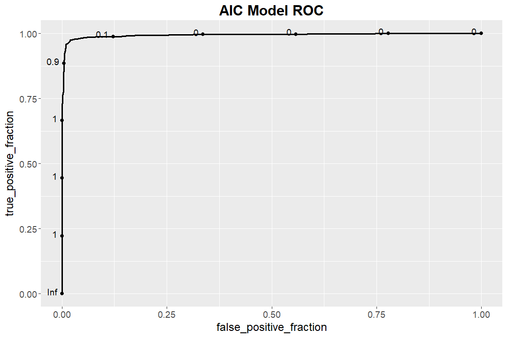

```{r setup, include=FALSE}
knitr::opts_chunk$set(echo = TRUE)
```

# Introduction 
Determining the gender of a voice is normally a very simple task. Typically, our ears are easily able to recognize the gender of the person speaking within a few words. We wanted to see if this held true for statistical models as well. We set out to explore the relationship between the acoustic properties of a voice and the speaker's gender, and attempted to create a model that could predict the gender of a voice as accurately as the human ear. We used the statistical methods learned in class in order to create a model that can predict the gender of a voice with 97.5% accuracy. This project focuses on the general process of approaching a classification problem, through data exploration, model creation, and model improvement. 

# Data Exploration
Before exploring basic trends in the data, the dataset was examined for anomalies, null values, and other characteristics that would skew our analysis. Since this dataset was from Kaggle, it was relatively prepared for processing aside from a few zero-values that were not explained in documentation. The dataset has 20 numerical features with 3,168 entries labelled as male or female. There were equal counts of male and female entries, and nearly every variable had eight degrees of decimal precision. 
    
Each feature was a component of an acoustic analysis performed on a subject's voice sample. For example, the dataset included metrics like mean frequency and maximum fundamental frequency in kHz. Since these were domain-specific features rooted in acoustic analysis, no inferences could immediately be made about the relative importance of features and what an entry would realistically sound like given the sound data. However, the data could be visualized to look for differentiating features given the gender labels. In the below figure, density plots are created for each feature and factored by label. Through this visual, it could be seen that mean fundamental frequency `meanfun`, IQR `IQR`, and the first frequency quantile `Q25` depict distinct peaks in densities. This suggests that these three features are primary predictors in the classification problem, and could be focused on for a strong portion of accuracy. In other density plots that display a lot of overlap, it is difficult to distinguish genders based solely on such features. There is more to be explored about the relationship between these features, though we can move onto building basic prediction models.


The below scatterplot of meanfun vs. IQR depicts a striking differentiation between the two genders, corresponding with our conclusions from the density plots. 


# Models and Predictions
## Logistic Regression 
First, a logistic regression model leveraging `meanfun`, `IQR`, and `Q25` was developed using the standard `glm()` function. With an arbitrary probability threshold of 0.5, the model then made predictions using the full dataset. The ROC curve of this model is shown below.


The ROC curve indicates that an optimal probability threshold is between 0.1 and 0.9. Starting from our initial threshold of 0.5, our results can be improved by tuning this value. We can test an arbitrary adjustment of 0.56, which marginally decreases the false positive rate at a slight tradeoff in decreasing the true postive rate. 

This model then has a `r (45+55)/(1529+1539)` accuracy rate. 

## Logistic Regression with forward stepwise selection 
Using forward stepwise selection, a logistic regression model is produced the features `meanfun`, `IQR`, `minfun`, `skew`, `sfm`, `sp.ent`, `modindx`, `kurt`. 
The ROC curve of this model is shown below.



The ROC curve is similar to the previous regression model.
Performing the same analysis, the model has a slightly improved accuracy rate of `r (36+43)/(1541/1548)`. 

## K-Nearest Neighbors


# Results and Conclusion


